Mục lục

CHƯƠNG 1. Summary 2

1.1. Mục tiêu 2

1.2. Vector tấn công 2

1.3. Hậu quả 2

CHƯƠNG 2. Recon 3

2.1. Công cụ 3
v
Burp Suite, Google, Dev tool 3

2.2. Phát hiện 3

Website sử dụng Eval() trong python để thực thi expression 3

Server sử dụng Werkzeug 3

Lộ filter và blacklist trong source code của HTML 3

2.3. Phân tích 3

CHƯƠNG 3. Exploitation 10

3.1. Phân tích lỗ hỏng 10

3.2. Payload 10

3.3. Proof of Content 16

CHƯƠNG 4. Remediation 18

4.1. Root cause: 18

4.2. Mitigation 18

# Summary

## Mục tiêu

Lỗ hổng trong bài này có mức độ ảnh hưởng cao. Chạy được lệnh python và lệnh hệ thống ở cấp độ cao.

## Vector tấn công

Input nhận vào 1 expression chưa được filter tốt. Tuy đã có filter 1 vài từ khóa (filter: os, cmd, ls, exec, …) và filter url encode, hex encode, unicode encode nhưng vẫn mắc nhưng sai lầm nghiêm trọng.

## Hậu quả

Server bị dính RCE, có thể gọi các module có sẵn trong bộ nhớ của python, module subprocess.Popen cho phép thực thi lệnh hệ thống.

# Recon

## Công cụ

Burp Suite, Google, Dev tool

## Phát hiện

Website sử dụng Eval() trong python để thực thi expression

Server sử dụng Werkzeug

Lộ filter và blacklist trong source code của HTML

## Phân tích

Trong phần miêu tả có nhắc đến eval(), tôi take note lại

Tôi dùng **burp-suite** bắt các gói http, https, xem các header response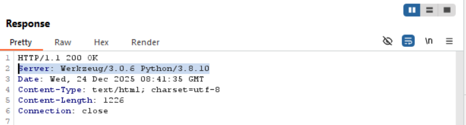

Server sử dụng Werkzeug (1 phiên bản khác của Flask) và Python 3.8.10. Tra cứu thấy trong Python có hàm Eval(), đây là hàm nhận đối số là 1 string để parse thành Abstract Syntax Tree và execute lệnh, và lệnh này nhận vào 1 input mà người dùng có thể tùy chỉnh, đây được xem là một dữ liệu người dùng không đáng tin cậy:

Sau khi review source code của trang web phát hiện có 1 comment còn để xót:

Điều này củng cố thêm thông tin về dùng hàm Eval(), tuy nhiên sẽ có 1 regex để lọc các command độc hại. Sau khi nghiên cứu, ta thấy no sẽ lọc giá trị hex, vd: 0xaf hoặc 0x0a, lọc giá trị unicode, vd: [\\\\u0061](\\\\u0061) hoặc [\\\\u00af,](\\\\u00af,) lọc giá trị url encode, %20 là "dấu cách" (chỉ lọc 2 kí tự của url encode, đây có thể là điểm yếu nên thử), lọc các đuôi file (điểm yếu; chỉ lọc extension có 3 kí tự trở xuống, vd lọc .sh, .exe, nếu tìm được extension nào có 4 kí tự trở lên sẽ bypass được), nó còn lọc kí tự \\ hoặc / để tránh truy cập file, thư mục trái phép, còn lọc thêm 2 dấu "." để tránh path traversal

Tiến hành test thử input và output sẽ trả về, tiến hành nhập input:

Và quan sát output trả về:

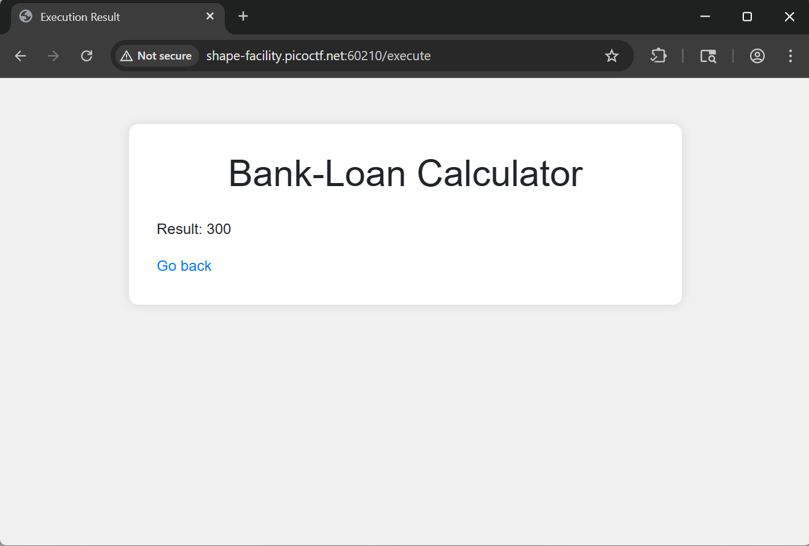

Lúc này **đặt câu hỏi**, sẽ như thế nào nếu mình ghi lệnh vào đó thay vì phép toán?, tiến hành đặt lệnh print:

Và quan sát kết quả:

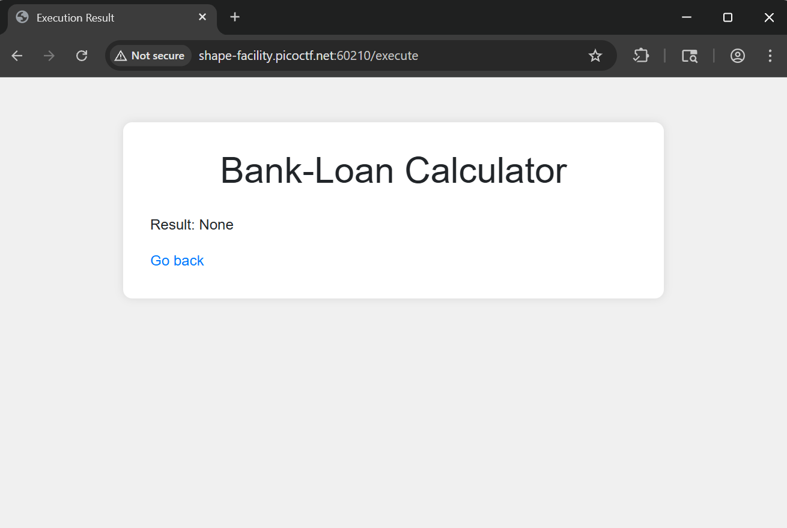

Có vẻ như có 1 filter hoặc lỗi nào đó nên kết quả không trả về được.Sau khi nghiên cứu về hàm Eval() thì nó sẽ nhận đối số là 1 string, python sẽ tiến hành parse và chạy lệnh đó. Nhưng cần lưu ý, eval chỉ nhận expression ( tức là chạy lệnh trả về biểu thức )

Như vậy nếu nó chỉ nhận một biểu thức, có 1 cách tấn công gọi là "Python Class Inheritance Tree Traversal" hoặc "Server Side Template Injection". Ta có thể thử payload ().\__class_\_._\_bases_\_\[0\].\__subclasses_\_(), giải thích:

Đây là cách truy vết ngược tất cả module được nạp sẵn vào bộ nhớ:

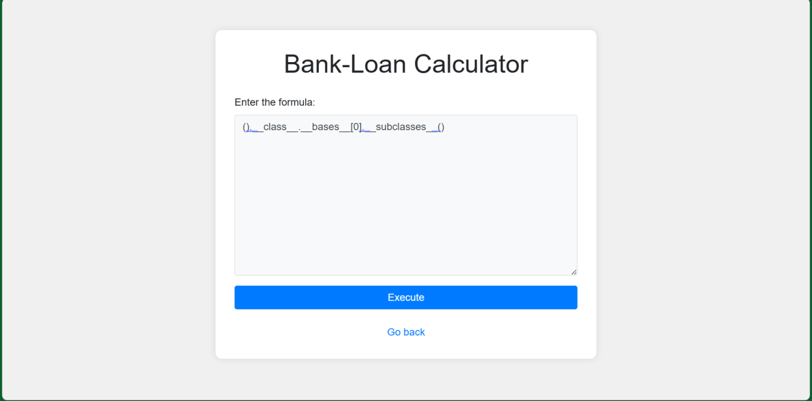

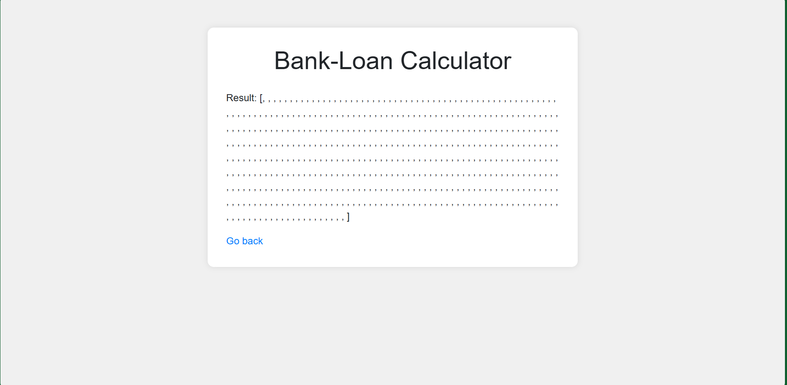

Có vẻ lệnh đã chạy thành công và trả về 1 list chứa toàn bộ module đã được nạp sẵn, tuy nhiên vì nó ở dạng object nên không render trực tiếp ra được, vậy ta dùng

\[f"{i} : {c.\__module_\_}.{c.\__name_\_}" for i, c in enumerate(().\__class_\_._\_bases_\_\[0\].\__subclasses_\_())\]

\__module__

là thuộc tính tên của module đó ở dạng string, \__name__ là thuộc tính của method trong module đó

Bây giờ ta có 1 list toàn bộ method được load sẵn trong bộ nhớ, vậy thì bây giờ nên dùng cái nào để tìm ra bí mất trên server này. Sau khi lược qua danh sách, ta thấy có 1 Class khá thú vị

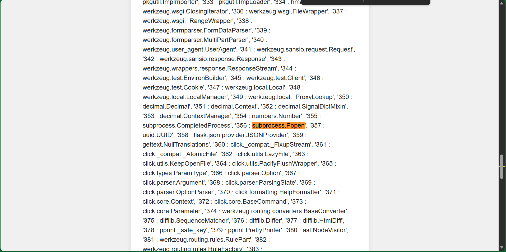

Đây là 1 method giúp chạy lệnh trên shell của server đó. Tóm lại nó có 3 đối số cần để ý nhất:

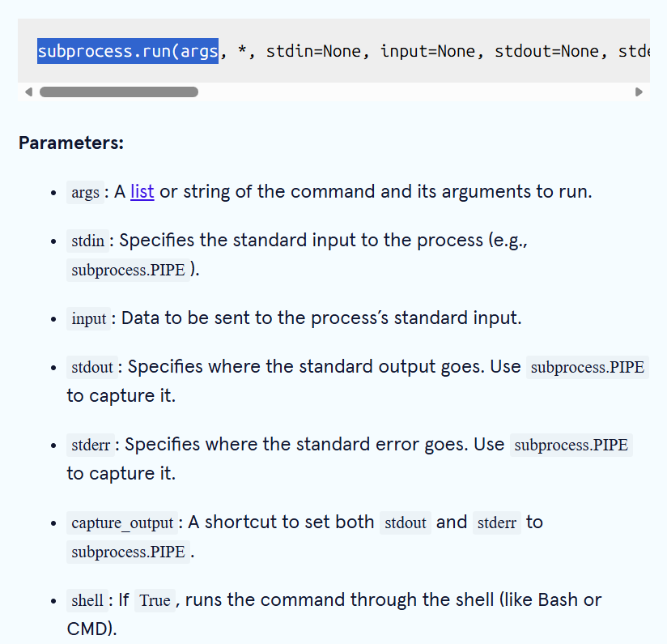

- Args: có thể là string hoặc là list chứa câu lệnh ( \['ls', '-la'\])
- Stdout: xác định ouput nên được gửi vào đâu ( stdout = subprocess.PIPE hoặc -1 đều gửi về terminal )
- Shell: false thì chạy lệnh trên execve() hay true thì lệnh chạy trên terminal

# Exploitation

## Phân tích lỗ hỏng

Đến đây ta xác định rằng nên chạy lệnh trong terminal thì RCE sẽ trở nên nguy hiểm nhất, tuy nhiên gặp phải filter: ls, cmd, os, exec, shell v.v, \\u, \\0x, %, \\, /, .., .

Từ "shell" bị filter nên không chạy Popen trong terminal được, ta phải chạy nó với execve với list các câu lệnh. Phải tìm lệnh nào có thể liệt kê file thay thế cho ls, tôi thử ll ( 1 alias cho ls -l )

## Payload

Tôi tìm được lệnh find, lệnh này sẽ duyệt qua cây thư mục và thực hiện điều kiện đằng sau đó, lênh:

**Find .**

Lệnh này tìm toàn bộ file trong thư mục hiện tại ( recursive ) và in ra tên file đó

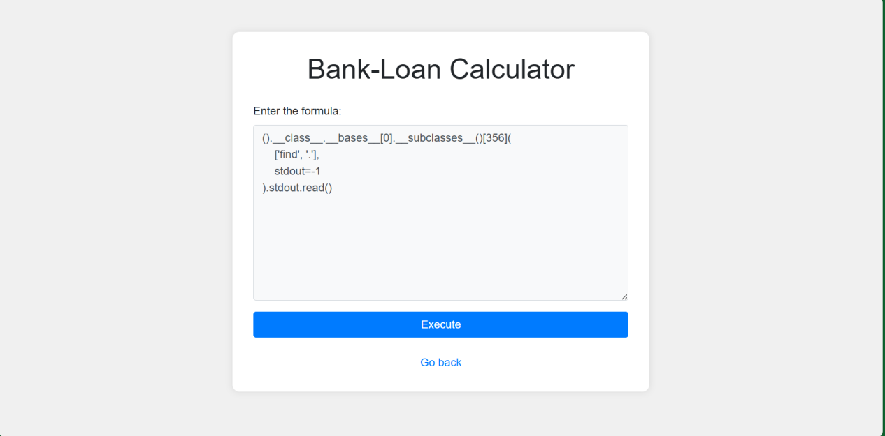

Sau khi định dạng lại cho dễ đọc ta được:

Tôi thử xem nội dung file app.py xem trong đó có gì

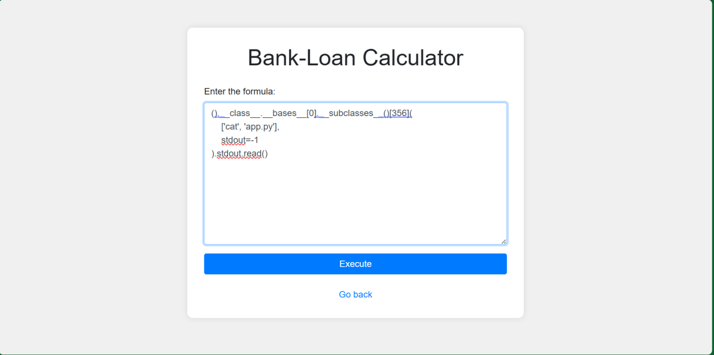

Đúng như dự đoán từ cat bị filter:

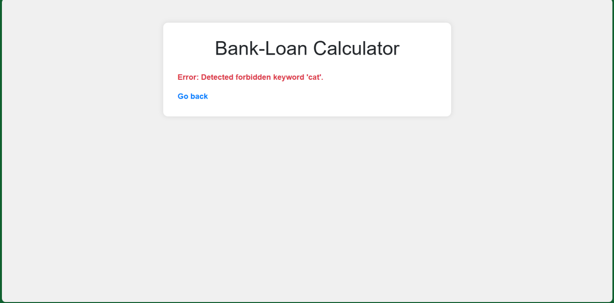

Tìm hiểu thêm về server, chúng ta có lệnh grep để tìm kiếm nội dung trong file, nhưng grep '' somefile thì lại lấy toàn bộ nôi dụng file

Nó bị filter .py, thay vì dùng trực tiếp .py ta phải tìm cách khác vượt qua filter trước rồi mới hình thành tên file.

Đầu tiên tôi đã nghĩ đến dùng unicode encode, url encode hoặc hex encode tuy nhiên chúng đều bị filter hết. Tôi đoán rằng filter sẽ được thực hiện trước rồi lệnh mới được bỏ vào Eval(). Khi lệnh được bỏ vào Eval(), python sẽ xem nó như lệnh hợp lệ, vậy thì tìm hàm nào giúp phân giải thành kí tự cần thiết, nó sẽ vượt qua được filter. Tôi đã tìm được hàm này trong python:

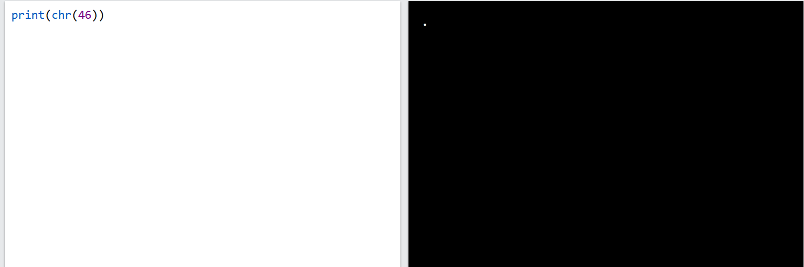

Hàm chr() nhận đối số là integer và ánh xạ nó thành 1 kí tự trong bảng unicode, chr(46) = ".", chr(47) = "/". Vậy là có cơ chế vượt qua bộ lọc rồi

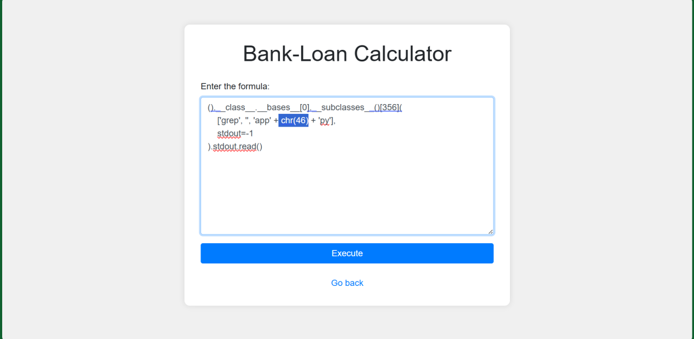

Ta đã đọc được nội dung của file app.py => đã vượt qua được filter

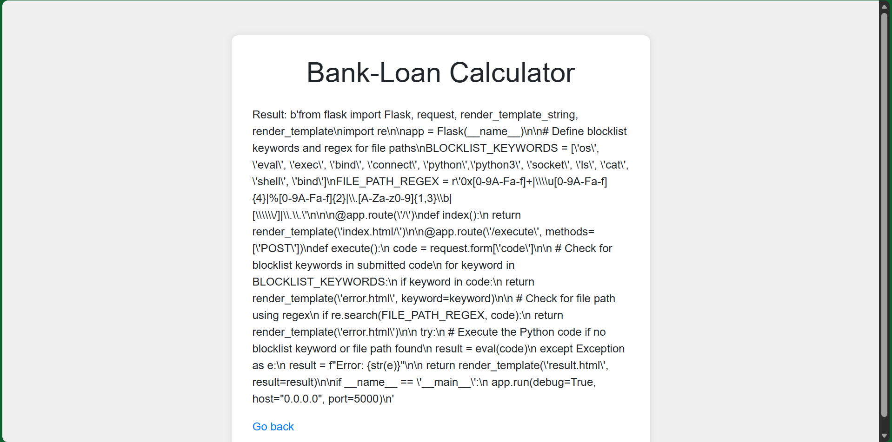

Xem xét qua file app.py có vẻ chúng ta đã đoán đúng, filter sẽ xảy ra trước rồi đến eval() thực hiện code, sau đó python thực hiện lệnh nó sẽ phân giải chr(46) thành ".":

Từ đây tôi có khả năng dùng "../" để escape ra khỏi thư mục hiện tại

Và làm sạch dữ liệu đã có các file và thư mục rõ ràng:

## Proof of Content

Và đến đây ta đã thấy file flag.txt là kết quả cần tìm, đây là payload cuối cùng:

Payload này cuối cùng sinh ra câu lệnh grep ../flag.txt và tada tôi đã tìm thấy flag:

**Đây là thứ cuối cùng cần tìm**

# Remediation

## Root cause

- Sử dụng blacklist sẽ dễ bị bypass bởi nó khó bao quát được hết trường hợp, có thể bypass bằng các kỹ thuật sau:

- Dùng hàm builtins của python, vd: hàm chr() decode thành kí tự unicode
- Dùng cách nối chuỗi trong python, 'o' + 's' => blacklist không phát hiện

- Sử dụng regex custom, có nhiều lỗ hỏng trong filter ( chỉ filter đuôi file &lt;= 3 ký tự vd: .py .exe, còn &gt;= 4 ký tự vd: .html thì không filter được ), có thể bypass bằng kỹ thuật sau:

- Tìm các thuộc tính như .\__class__ chẳng hạn, miễn 2 kí tự cuối là non-word sẽ bypass được

- Sử dụng eval() để chạy trực tiếp input người dùng đưa vào

- Eval được phép chạy với globals namespace của module hiện tại, điều này dẫn tới truy cập được \__builtins_\_, trong đó có \__import__ có thể thực hiện hành động \__builtins_\_._\_import_\_\['os'\].system('some command')
- Thực hiện Python Object Model Traversal, có thể truy ngược lại các hàm builtins có sẵn trong bộ nhớ, vd: ().\__class_\_._\_bases_\_\[0\]\__.\__subclasses_\_(): lấy toàn bộ class được nạp sẵn vào bộ nhớ

## Mitigation

Tuyệt đối không dùng hàm Eval() cho các tính năng nhận input bất kì từ người dùng. Cũng như filter bằng blacklist về bản chất đã là không bảo mật và có thể bị vượt qua bằng enconding tricks, object traversal và các hàm có sẵn của python. Cả việc viết đè \__builtins__trong dictionary truyền vào cho đối số globals của hàm Eval() vẫn có nguy cơ bị RCE ( nếu hacker tìm được object nào có sẵn trong module hiện tại ). Ngay cả sử dụng ast.literal_eval() cũng không đáp ứng được yêu cầu, vì nó phá vỡ chức năng tính toán.

Nếu vẫn cần biểu thức toán tử và toán hạng trong nên sử dụng 1 custom AST-based evaluator sử dụng 1 whitelist các toán tử được phép dùng trong expression ( +-\*/)